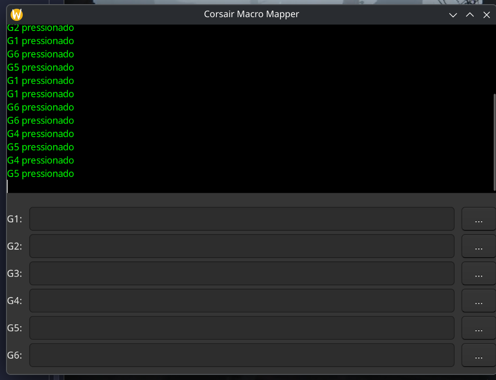

# Corsair Macro Mapper



Uma ferramenta em C para mapear e executar macros através das teclas G de teclados Corsair (K95 Platinum) no Linux, utilizando a interface `hidraw`.


## 🚀 Funcionalidades

- **Leitura Direta HID**: Utiliza `hidraw` para capturar teclas G que normalmente não são registradas pelo sistema.
- **Interface Gráfica (GTK3)**: Interface minimalista com log estilo terminal (fundo preto, fonte verde).
- **Mapeamento de Macros (G1-G6)**:
  - Execute scripts executáveis.
  - Abra pastas no gerenciador de arquivos.
  - Abra documentos ou sites com o programa padrão (`xdg-open`).
- **Auto-save**: Todas as configurações são salvas automaticamente no arquivo `macros.conf`.
- **Seleção Facilitada**: Botões de busca (`...`) para selecionar arquivos ou pastas facilmente.

## 🛠️ Requisitos

- Linux
- GTK3 Development Headers (`libgtk-3-dev`)
- GCC & Make
- Permissões de acesso aos dispositivos `/dev/hidraw*` (o programa tenta abrir os dispositivos Corsair automaticamente).

## 📥 Instalação

1. Clone o repositório:
   ```bash
   git clone git@github.com:surfx/corsair_k95_g_keys.git
   cd readcorsair
   ```

2. Compile o projeto usando o script de build:
   ```bash
   bash scripts/build.sh
   ```

## 🖥️ Uso

Para iniciar a aplicação:

```bash
bash scripts/run.sh
```

### Comandos Adicionais

- **Listar Dispositivos**: `bash scripts/run.sh --list`
- **Modo Verbose (Debug)**: `bash scripts/run.sh -v`
- **Encerrar Aplicação**: `bash scripts/kill.sh`

## ⚙️ Configuração

As macros são salvas no arquivo `macros.conf` na raiz do projeto. Você pode editar os caminhos diretamente na interface gráfica ou no arquivo de texto.
